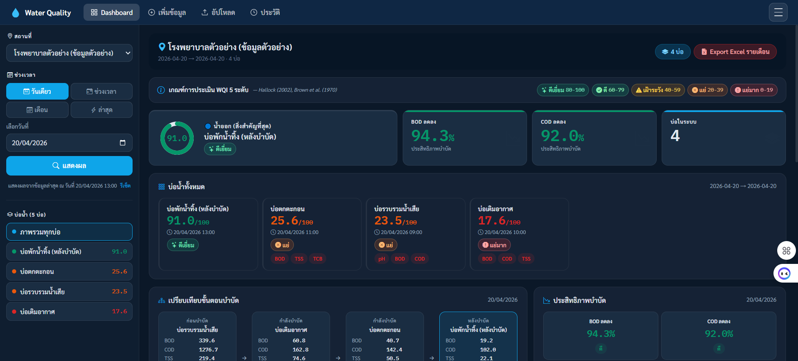
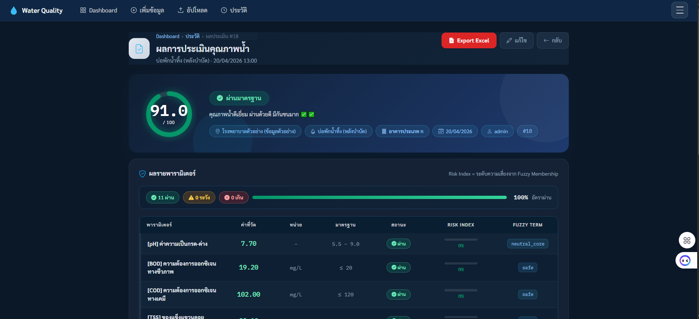
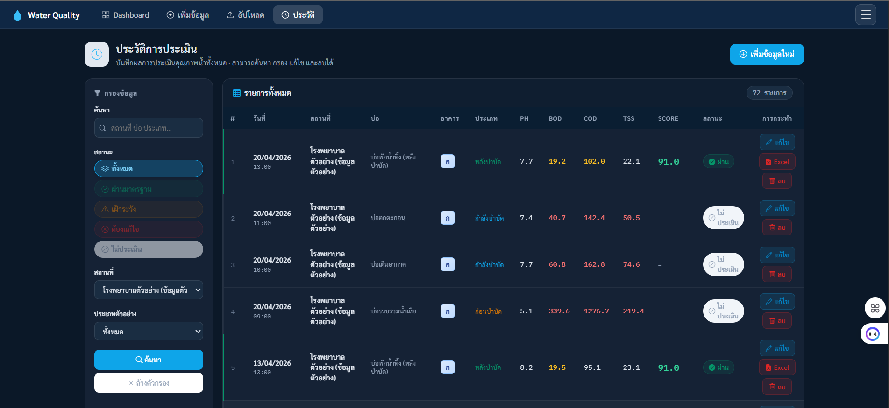

# ระบบประเมินและติดตามคุณภาพน้ำทิ้ง
## Water Quality Assessment System

เว็บแอปพลิเคชันสำหรับประเมินและติดตามคุณภาพน้ำทิ้ง โดยใช้ **Fuzzy Logic** เพื่อวิเคราะห์ค่าคุณภาพน้ำหลายพารามิเตอร์ร่วมกัน และแสดงผลเป็นคะแนนคุณภาพน้ำในรูปแบบ 5 ระดับ

โปรเจกต์นี้พัฒนาขึ้นเพื่อเป็นส่วนหนึ่งของโครงงานด้านวิศวกรรมคอมพิวเตอร์ โดยมุ่งเน้นการประยุกต์ใช้ **Web Application, Database, Fuzzy Logic และ Data Visualization** เข้าด้วยกัน

---
## 🖥️ System Screenshots

### Dashboard


### Fuzzy Assessment Result


### Assessment History


---

## ✨ Features

- 🔬 ประเมินคุณภาพน้ำด้วย **Mamdani Fuzzy Logic**
- 📊 แสดงผลเป็นคะแนนคุณภาพน้ำ **0–100**
- 🏷️ แบ่งระดับคุณภาพน้ำออกเป็น 5 ระดับ
  - **Excellent** — 80–100
  - **Good** — 60–79
  - **Fair** — 40–59
  - **Poor** — 20–39
  - **Very Poor** — 0–19
- 🏥 รองรับการประเมินตามประเภทอาคาร **ก / ข / ค / ง**
- 💧 รองรับการประเมินพารามิเตอร์คุณภาพน้ำ 11 รายการ
- 📝 เพิ่มข้อมูลคุณภาพน้ำผ่านแบบฟอร์ม
- 📁 นำเข้าข้อมูลจาก Excel
- ✏️ แก้ไขและลบข้อมูลคุณภาพน้ำ
- 📈 Dashboard สำหรับติดตามข้อมูลและแนวโน้ม
- 📜 ระบบเก็บประวัติผลการประเมิน
- 🔐 ระบบ Login และการจัดการสิทธิ์ผู้ใช้งาน
- 📄 Export ผลการประเมินและรายงาน
- 🌐 มี Public Dashboard สำหรับแสดงข้อมูลที่เปิดเผยได้
- 🔌 มี API สำหรับข้อมูลบางส่วนของระบบ

---

## 🧠 Fuzzy Logic Assessment

ระบบใช้ **Mamdani Fuzzy Inference System** ในการประเมินคุณภาพน้ำ โดยนำค่าพารามิเตอร์ต่าง ๆ เข้าสู่ระบบ Fuzzy และใช้ Membership Functions กับชุดกฎ (Fuzzy Rules) เพื่อคำนวณผลลัพธ์

### Input Parameters

ระบบรองรับพารามิเตอร์หลัก 11 รายการ:

| Parameter | Description |
|---|---|
| pH | ค่าความเป็นกรด-ด่าง |
| BOD | Biochemical Oxygen Demand |
| COD | Chemical Oxygen Demand |
| TSS | Total Suspended Solids |
| TDS | Total Dissolved Solids |
| O&G | Oil and Grease |
| TKN | Total Kjeldahl Nitrogen |
| Sulfide | Sulfide |
| TCB | Total Coliform Bacteria |
| FCB | Fecal Coliform Bacteria |
| Cl₂ | Free Chlorine |

### Output

ผลลัพธ์จาก Fuzzy System อยู่ในช่วง **0–100** และแบ่งเป็น 5 ระดับ:

| Score | Quality Level |
|---:|---|
| 80–100 | Excellent |
| 60–79 | Good |
| 40–59 | Fair |
| 20–39 | Poor |
| 0–19 | Very Poor |

ระบบมี Fuzzy Rules สำหรับจัดการสถานการณ์ต่าง ๆ เช่น

- ค่าพารามิเตอร์อยู่ในระดับปลอดภัย
- ค่าพารามิเตอร์อยู่ในระดับปานกลาง
- ค่าพารามิเตอร์เกินมาตรฐาน
- ความผิดปกติของ pH
- ความผิดปกติของ Free Chlorine
- ค่า TCB / FCB สูง
- ค่า BOD และ TKN สูงร่วมกัน
- ค่า Oil & Grease สูง
- กรณีที่เกี่ยวข้องกับความเสี่ยงด้านจุลชีววิทยา

---

## 🏢 Building Types

ระบบรองรับการประเมินตามประเภทอาคาร 4 ประเภท ได้แก่ **ก, ข, ค และ ง**

### เกณฑ์ที่ใช้ในระบบ

| Parameter | ก | ข | ค | ง |
|---|---:|---:|---:|---:|
| pH | 5.5–9.0 | 5.5–9.0 | 5.5–9.0 | 5.5–9.0 |
| BOD (mg/L) | ≤20 | ≤30 | ≤40 | ≤100 |
| COD (mg/L) | ≤120 | ≤120 | ≤120 | ≤120 |
| TSS (mg/L) | ≤30 | ≤40 | ≤50 | ≤60 |
| TDS (mg/L) | ≤1000 | ≤1000 | ≤1300 | ไม่กำหนด |
| O&G (mg/L) | ≤20 | ≤20 | ≤20 | ≤50 |
| TKN (mg/L) | ≤35 | ≤35 | ≤40 | ไม่กำหนด |
| Sulfide (mg/L) | ≤1.0 | ≤1.0 | ≤1.0 | ไม่กำหนด |
| TCB (MPN/100 mL) | ≤5,000 | ≤5,000 | ไม่กำหนด | ไม่กำหนด |
| FCB (MPN/100 mL) | ≤1,000 | ≤1,000 | ไม่กำหนด | ไม่กำหนด |
| Free Cl₂ (mg/L) | ≤1.0 | ≤1.0 | ไม่กำหนด | ไม่กำหนด |

> `ไม่กำหนด` หมายถึงพารามิเตอร์ดังกล่าวไม่มีเกณฑ์ควบคุมในประเภทอาคารนั้นภายใน implementation ปัจจุบันของระบบ

---

## 🔄 System Workflow

```text
Input Water Quality Data
        │
        ├── Manual Form
        │
        └── Excel Upload
                │
                ▼
       Validate Input Data
                │
                ▼
     Select Building Type
          ก / ข / ค / ง
                │
                ▼
       Fuzzy Logic System
                │
        ┌───────┴───────┐
        │ Membership    │
        │ Functions     │
        └───────┬───────┘
                │
                ▼
         Fuzzy Rules
                │
                ▼
       Defuzzification
                │
                ▼
        Score 0–100
                │
                ▼
  Excellent / Good / Fair /
       Poor / Very Poor
                │
                ▼
       Store Evaluation
                │
                ▼
      Dashboard / History


🛠️ Technology Stack
Backend
Python
Flask
Flask-SQLAlchemy
Flask-Login
scikit-fuzzy
Data Processing
NumPy
Pandas
OpenPyXL
Frontend
HTML
CSS
JavaScript
Bootstrap 5
Chart.js
Database
SQLite
Development Tools
Git
GitHub
Visual Studio Code
Postman


📂 Project Structure
water-quality-assessment/
│
├── app.py
├── config.py
├── fuzzy_logic.py
├── init_db.py
├── models.py
├── xlsx_io.py
├── test_fuzzy.py
├── requirements.txt
│
├── README.md
├── INSTALL_GUIDE.md
├── QUICKSTART.md
├── COMMANDS_CHEATSHEET.md
├── FILE_LIST.md
├── CHANGELOG_v2.md
│
├── sample_data.xlsx
│
├── static/
│   └── css/
│       └── style.css
│
└── templates/
    ├── 404.html
    ├── 500.html
    ├── add_data.html
    ├── edit.html
    ├── history.html
    ├── login.html
    ├── navbar.html
    ├── public_dashboard.html
    ├── result.html
    ├── staff_home.html
    └── upload_data.html


🚀 Installation
Requirements
Python 3.8+
Git
pip
1. Clone Repository
git clone https://github.com/tatyaswer-pixel/water-quality-assessment.git
cd water-quality-assessment
2. Create Virtual Environment
Windows
python -m venv venv
venv\Scripts\activate
macOS / Linux
python3 -m venv venv
source venv/bin/activate
3. Install Dependencies
pip install -r requirements.txt
4. Set Admin Password

ก่อนเริ่มต้นระบบ ให้กำหนด Environment Variable สำหรับรหัสผ่านของ Admin

Windows CMD
set ADMIN_PASSWORD=your_secure_password
Windows PowerShell
$env:ADMIN_PASSWORD="your_secure_password"

5. Initialize Database
python init_db.py
6. Run Application
python app.py

เปิดเว็บไซต์ที่:

http://127.0.0.1:5000
🔐 Configuration

ระบบใช้ Environment Variables สำหรับข้อมูลสำคัญ เช่น Admin Password และ Secret Key

ตัวอย่าง:

Windows CMD
set ADMIN_PASSWORD=your_secure_password
set SECRET_KEY=your_secret_key
Windows PowerShell
$env:ADMIN_PASSWORD="your_secure_password"
$env:SECRET_KEY="your_secret_key"

ควรเก็บค่าดังกล่าวไว้ใน Environment Variables และไม่ Commit ไฟล์ .env หรือข้อมูลลับเข้าสู่ Repository

📊 Excel Import

ระบบรองรับการนำเข้าข้อมูลคุณภาพน้ำจากไฟล์ .xlsx

Columns หลัก
sample_date
sample_location
sample_type
building_type
pH
BOD
COD
TSS
TDS
O&G
TKN
Sulfide
TCB
FCB
Cl2

โดย building_type ใช้ระบุประเภทอาคาร: ก ข ค ง

ไฟล์ตัวอย่างสามารถดูได้จาก:

sample_data.xlsx
🧪 Testing


ระบบมีไฟล์สำหรับทดสอบ Fuzzy Logic:

python test_fuzzy.py

ใช้สำหรับตรวจสอบการทำงานของระบบประเมินคุณภาพน้ำและผลลัพธ์จาก Fuzzy Inference System

🔌 API

ระบบมี API สำหรับข้อมูลบางส่วน เช่น:

GET /api/locations-and-ponds

และระบบประเมิน/จัดการข้อมูลผ่าน Flask routes ภายใน Application

API สามารถทดสอบเพิ่มเติมด้วย Postman

📈 Reports & History

ระบบสามารถ:
ดูผลการประเมินแต่ละรายการ
ดูประวัติการประเมิน
ติดตามข้อมูลคุณภาพน้ำ
Export ผลการประเมิน
Export รายงานประจำเดือน
🔒 Security Considerations

Repository นี้ตั้งค่า .gitignore เพื่อป้องกันไฟล์ที่ไม่ควรเผยแพร่ เช่น:

.env
*.db
instance/
static/uploads/
__pycache__/
venv/
.venv/

รหัสผ่านของ Admin ไม่ได้ถูก hard-code ใน Source Code แต่รับผ่าน ADMIN_PASSWORD

📌 Project Status

Current Version: Fuzzy Logic Assessment System v3.x

ระบบอยู่ในขั้นตอนพัฒนาและปรับปรุงสำหรับการใช้งานในลักษณะ Academic / Portfolio Project

🔮 Future Improvements
เพิ่มระบบ Authentication และ Role Management ให้ละเอียดขึ้น
เพิ่มการจัดการ Database สำหรับ Production Environment
เพิ่ม API สำหรับเชื่อมต่อกับระบบภายนอก
เพิ่มระบบ Visualization สำหรับพารามิเตอร์แต่ละรายการ
เพิ่มระบบแจ้งเตือนเมื่อค่าคุณภาพน้ำมีแนวโน้มเกินมาตรฐาน
ปรับปรุง Fuzzy Rules และ Membership Functions จากข้อมูลจริง
เพิ่ม Automated Testing
เพิ่มระบบ Deployment สำหรับ Production
🎓 Project Purpose

โปรเจกต์นี้จัดทำขึ้นเพื่อศึกษาและประยุกต์ใช้ความรู้ด้าน:

Web Application Development
Database Management
Fuzzy Logic
Data Processing
Data Visualization
Software Testing
Version Control with Git/GitHub

โดยมีเป้าหมายเพื่อพัฒนาระบบต้นแบบสำหรับช่วยประเมินและติดตามคุณภาพน้ำทิ้งอย่างเป็นระบบ

📄 License

Educational / Academic Project

👨‍💻 Developer

Thanathat Janthana

Computer Engineering Graduate

GitHub: tatyaswer-pixel